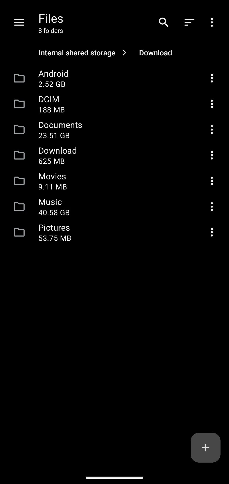
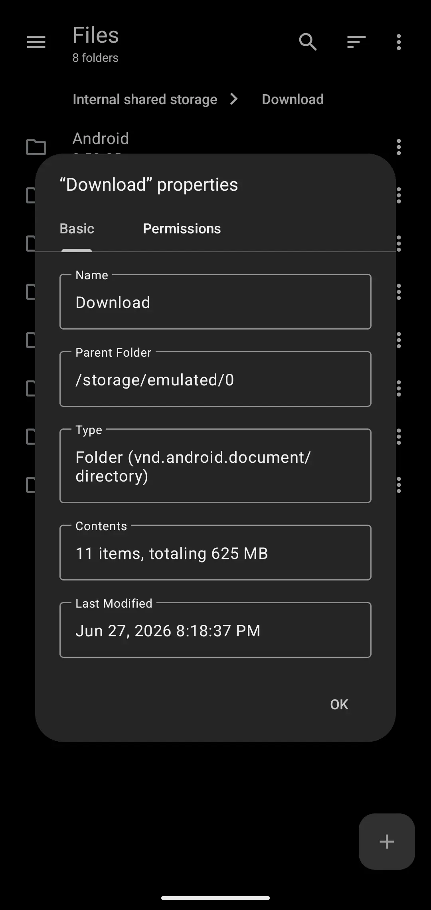
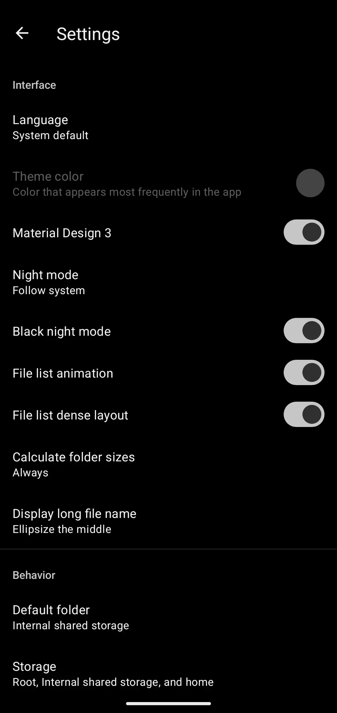
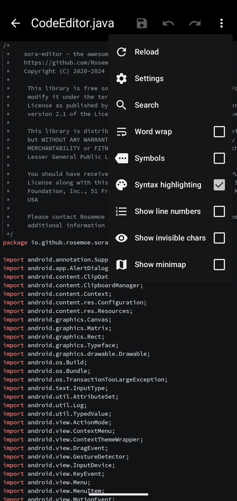

# Material Files (fork)

An open source Material Design file manager for Android 6.0+ (with QoL improvements)

## Preview

## Changes

- [Sora Editor](htthttps://github.com/Rosemoe/sora-editor) (from [Citrinae-Lime](https://github.com/Citrinae-Lime)), with:
  - Search and replace, themes, fonts etc
- [Telephoto](https://github.com/saket/telephoto) for images (instead of PhotoView)
- Folder size calculation
- Audio player
- Modify archives (rename, delete, paste into, edit, etc)
- Additional archive formats: zstd, gzip, tar
- Compression levels
- Termux in 'Open in Terminal'¹ (root-only paths supported)
- Migration from Groovy to Kotlin DSL

Credits to [Hai Zhang](https://github.com/zhanghai) for Material Files, [Citrinae-Lime](https://github.com/Citrinae-Lime) for the Sora Editor modifications

Notice: upstream Material Files, after a hiatus, has started to make a new release again. My changes have been squashed in the [`merges`](https://github.com/jeeneo/filesfork/tree/merges) branch with upstream added on top. Due to this, the app identifier has been renamed from `me.zhanghai.android.filesfork` back to `me.zhanghai.android.files` to keep merges simpler. In due time, maybe these changes will get merged upstream but can't say for certain.

My releases will be reflected as changes diverge, previously `v1.7.4+6` reflected 6 changes after the upstream version, following versions will apply the same logic, e.g., `v1.7.5+1` means it is the `v1.7.5` upstream release with my changes added. The last digit will reflect my changes (bug fixes, small features, etc) so that the real version does not change and will reset after any upstream version change.

## Additional info

¹ For the "Open in Terminal" function to properly work in Termux, you need to first edit the `~/.termux/termux.properties` file from within termux, and set `allow-external-apps = true` ([info](https://wiki.termux.com/wiki/Terminal_Settings), [more info](https://github.com/termux/termux-app/wiki/RUN_COMMAND-Intent#allow-external-apps-property-mandatory)), then grant the permission from Material Files' "App Info" in settings, usually the flow is `Settings > Apps > Material Files > Permissions > Additonal permissions > Run commands in termux environment` (might be slightly different depending on your device/OS)

## AI policy

PRs or Issues heavily written by LLMs will be ignored and closed without warning. AI-assisted code is acceptible only if:
- The submitter understands and can fully can explain what the code does without the help of LLMs, this means do not use LLMs to write the the body of your issue/PR
- Doesn't add unnecessary maintance burdens or is overly complex, including but not limited to thousands of changes at once or feature-heavy additions, this is just for QoL features, not an entire suite. I want to keep the app small and light

## License

    Copyright (C) 2018 Hai Zhang

    This program is free software: you can redistribute it and/or modify
    it under the terms of the GNU General Public License as published by
    the Free Software Foundation, either version 3 of the License, or
    (at your option) any later version.

    This program is distributed in the hope that it will be useful,
    but WITHOUT ANY WARRANTY; without even the implied warranty of
    MERCHANTABILITY or FITNESS FOR A PARTICULAR PURPOSE.  See the
    GNU General Public License for more details.

    You should have received a copy of the GNU General Public License
    along with this program.  If not, see <https://www.gnu.org/licenses/>.
